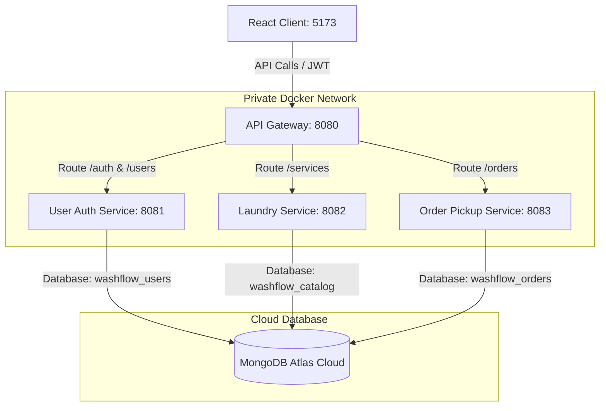

# 🌊 WashFlow — Microservices Laundry Platform


---

## 📝 Introduction

**WashFlow** is an enterprise-grade Service-Oriented Computing (SOC) laundry pickup, delivery, and catalog management platform. Built to demonstrate microservices architecture patterns, the system decouples laundry catalog management, registration/authentication, and order lifecycles into autonomous services.

All microservices communicate internally within a private Docker virtual network, secure service-to-service endpoints with API Keys, coordinate requests through a centralized API Gateway with rate limiting, and persist transactional data to MongoDB Atlas. A high-fidelity, true-black glassmorphic React interface provides the front-end user experience.

---

## 🏛️ System Architecture

Clients communicate exclusively with the API Gateway. The Gateway performs JWT validation, rate limiting, and routes requests to the corresponding downstream microservice inside the private Docker network.



---

## 📋 Microservices Registry

| Service | Port | Database (Atlas) | Description |
| :--- | :---: | :--- | :--- |
| **API Gateway** | `8080` | None | Access point, JWT validation, rate limiting, and request forwarding. |
| **User & Auth Service** | `8081` | `washflow_users` | Handles registration, authentication, and user profiles. |
| **Laundry Service** | `8082` | `washflow_catalog` | Manages laundry services catalog, pricing, and timing. |
| **Order & Pickup Service** | `8083` | `washflow_orders` | Handles order creation, lifecycle transitions, and pickup locations. |
| **React Client** | `5173` | Local Storage | Sleek, edge-to-edge true black glassmorphic React + Vite user interface. |

---

## 🔍 Detailed Component Breakdown

### 1. API Gateway (`:8080`)
The entry point of all client traffic.
- **Routing Rules**: Evaluates matching path predicates (e.g. `/auth/**`, `/services/**`) and forwards them internally to microservices.
- **JWT Verification**: Validates incoming `Authorization: Bearer <JWT>` tokens using `JwtAuthenticationFilter.java` and rejects requests missing proper claims.
- **IP Rate Limiter**: Limits requests using `RateLimitFilter.java` to a maximum of 500 requests per minute per client IP address.

### 2. User & Auth Service (`:8081`)
Manages identities and logins.
- **BCrypt Hashing**: Hashes passwords using BCrypt on signup.
- **Profile Management**: Exposes user read/update CRUD operations.

### 3. Laundry Service (`:8082`)
Maintains the available laundry options and catalog items.
- **Service Schemas**: Stores service item details: `name`, `description`, `price` (in LKR), and `estimatedMinutes`.
- **API Key Security**: Exposes direct endpoints only to clients presenting `X-API-KEY: washflow-laundry-dev-key-2026`.

### 4. Order & Pickup Service (`:8083`)
Manages scheduled orders and delivery lifecycles.
- **Service Verification**: Validates the selected service ID before scheduling.
- **7-Stage Lifecycle**: Traces statuses through:
  `ORDER_PLACED` ➔ `PICKUP_SCHEDULED` ➔ `PICKED_UP` ➔ `WASHING` ➔ `READY_FOR_DELIVERY` ➔ `OUT_FOR_DELIVERY` ➔ `DELIVERED`.
- **API Key Security**: Exposes direct endpoints only to clients presenting `X-API-KEY: washflow-order-pickup-dev-key-2026`.

## ⚙️ Environment Setup

1. Copy the template file to create your active environment file:
   ```bash
   cp .env.example .env
   ```
2. Open the `.env` file and populate it with your MongoDB Atlas connection URIs and JWT security secrets.

*Note: The `.env` file contains sensitive local credentials and is configured in `.gitignore` to prevent committing it to source control.*

---

## 🚀 How to Run (Using Docker Compose)

Make sure you have **Docker Desktop** installed and running on your host machine.

### Start the entire platform:
```bash
docker compose up --build -d
```

This single command:
1. Provisions a private bridge network (`washflow-network`).
2. Builds and starts all three backend Spring Boot microservices.
3. Builds and starts the API Gateway.
4. Builds the React Client production bundle and serves it on an optimized Alpine Nginx server.
5. Verifies container health sequences.

### Check Status:
```bash
docker compose ps
```

### Stop/Tear down:
```bash
docker compose down
```

---

## 📖 Swagger UI Endpoints

Each backend microservice hosts its own OpenAPI/Swagger UI playground directly on its exposed port. You can use this to execute CRUD requests directly.

| Microservice | Swagger UI URL | Required Header Authorization Key |
| :--- | :--- | :--- |
| **User & Auth Service** | [http://localhost:8081/swagger-ui/index.html](http://localhost:8081/swagger-ui/index.html) | None (Public Auth Endpoints) |
| **Laundry Service** | [http://localhost:8082/swagger-ui/index.html](http://localhost:8082/swagger-ui/index.html) | `X-API-KEY: washflow-laundry-dev-key-2026` |
| **Order & Pickup Service** | [http://localhost:8083/swagger-ui/index.html](http://localhost:8083/swagger-ui/index.html) | `X-API-KEY: washflow-order-pickup-dev-key-2026` |

### To authorize a service in Swagger:
1. Open the respective Swagger UI link.
2. Click the green **Authorize** button in the top right.
3. Paste the corresponding `X-API-KEY` value in the textbox and click **Authorize**.

---

## 🧪 Terminal Testing

You can run automated end-to-end CRUD verification tests directly from your PowerShell terminal. This script will execute health checks, register users, login, query/update profiles, create services, and walk an order through its 6 lifecycle status stages:

```powershell
powershell -ExecutionPolicy Bypass -File test-crud.ps1
```

For step-by-step copy-paste testing instructions, reference the [test-manual.ps1](file:///d:/soc/washflow-microservices/washflow-microservices/test-manual.ps1) file.

---

## 🔗 API Endpoint Reference

### 1. User & Auth Endpoints (Port 8081 / Gateway 8080)
- `POST /auth/register` (Public) - Register customer account.
- `POST /oauth/token` (Public) - Acquire JWT access token.
- `GET /users/{id}` (JWT Required) - Fetch profile.
- `PUT /users/{id}` (JWT Required) - Update profile details.

### 2. Laundry Service Endpoints (Port 8082)
- `GET /services` (API Key Required) - Fetch all services.
- `POST /services` (API Key Required) - Create new service.
- `GET /services/{id}` (API Key Required) - Fetch single service.
- `PUT /services/{id}` (API Key Required) - Edit service details.
- `DELETE /services/{id}` (API Key Required) - Remove service.

### 3. Order Service Endpoints (Port 8083)
- `POST /orders` (API Key Required) - Place order.
- `GET /orders` (API Key Required) - List all orders.
- `GET /orders/{id}` (API Key Required) - Fetch single order details.
- `PUT /orders/{id}` (API Key Required) - Update status lifecycle stage.
- `DELETE /orders/{id}` (API Key Required) - Delete order.

---

## 💻 React Web Application Client

The React application runs at [http://localhost:5173](http://localhost:5173). 

### Key Features:
- **Ultra-Dark True Black Theme**: Clean and sleek user interface (`#000000` base, `#0A0A0A` surfaces) with high-contrast glowing aqua-teal highlights.
- **Top Horizontal Navbar**: Fixed full-width navigation containing interactive menu items, inline active states, user avatar initials display, and responsive collapsible drawers.
- **Modern User Profile Section**: Allows users to dynamically configure their cover banners and profile picture avatars (persisted in `localStorage` per user account).
- **Animated Auth Screen Panels**: Beautiful glassmorphic Login and Register cards layered on slow-moving floating water-bubble backdrops.
